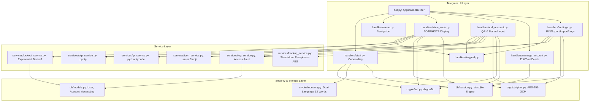

# Telegram MFA Authenticator Bot Implementation Plan

> **For agentic workers:** REQUIRED SUB-SKILL: Use superpowers:subagent-driven-development to implement this plan task-by-task. Steps use checkbox (`- [ ]`) syntax for tracking.

**Goal:** Build a multi-tenant Telegram MFA Authenticator Bot in Python that securely stores, encrypts (AES-256-GCM + Argon2id derived from user PIN), and generates TOTP/HOTP codes with inline numeric keypad interactions, visual countdowns, and automated 30s message deletion.

**Architecture:** A modular, service-oriented architecture where cryptography, database storage (async SQLAlchemy + SQLite), domain services (OTP, QR, lockout, audit, backup), and Telegram UI handlers communicate through clean typed interfaces without master keys on the server. All PIN inputs use inline button keypads and session buffers, with OTPs rendered in tap-to-copy monospace (`<code>123456</code>`).

**Architecture Diagram:**



**Tech Stack:**
- Python 3.11+
- `python-telegram-bot>=20.0` (async)
- `pyotp>=2.9.0`
- `cryptography>=41.0.0`
- `argon2-cffi>=23.1.0`
- `sqlalchemy>=2.0.0`, `aiosqlite>=0.19.0`
- `pyzbar>=0.1.9`, `pillow>=10.0.0`, `qrcode>=7.4.2`
- `python-dotenv>=1.0.0`, `pydantic-settings>=2.0.0`
- `pytest>=7.4.0`, `pytest-asyncio>=0.21.0`

## Global Constraints
- Python 3.11+ compatible code with explicit typing.
- No master key stored on server; all account secrets encrypted using AES-256-GCM with keys derived from user PIN + user `kdf_salt` via Argon2id.
- PIN verification hash uses Argon2id with separate `pin_hash_salt`.
- OTP codes displayed in `<code>123456</code>` without space for instant tap-to-copy.
- Sensitive messages (OTP codes, recovery phrases, export files) auto-deleted after 30 seconds.
- Multi-tenant isolation: every query explicitly scoped to `telegram_user_id`.
- Zero sensitive data in logs (no PINs, secrets, or OTP codes).

---

### Task 1: Environment, Configuration, and Test Infrastructure

**Files:**
- Create: `requirements.txt`
- Create: `config.py`
- Create: `.env.example`
- Create: `tests/__init__.py`
- Create: `tests/conftest.py`

**Interfaces:**
- Produces: `config.get_settings() -> Settings` (with `bot_token: str`, `db_path: str`, `log_level: str`, `pin_length: int = 6`)
- Produces: `conftest.py` with async db fixtures and test environment variables.

- [ ] **Step 1: Write requirements.txt and .env.example**
```text
python-telegram-bot[job-queue]>=20.7
pyotp>=2.9.0
cryptography>=41.0.0
argon2-cffi>=23.1.0
sqlalchemy>=2.0.25
aiosqlite>=0.19.0
pyzbar>=0.1.9
Pillow>=10.2.0
qrcode>=7.4.2
pydantic-settings>=2.1.0
python-dotenv>=1.0.0
pytest>=7.4.0
pytest-asyncio>=0.23.0
```

- [ ] **Step 2: Write failing test for config loader**
Create `tests/test_config.py` asserting `get_settings()` loads defaults and validates token requirements.

- [ ] **Step 3: Implement config.py using Pydantic Settings**
Implement `Settings` reading `BOT_TOKEN`, `DB_PATH="mfa_bot.db"`, `LOG_LEVEL="INFO"`, `PIN_LENGTH=6`.

- [ ] **Step 4: Run pytest tests/test_config.py and verify PASS**
Run: `pytest tests/test_config.py -v`

---

### Task 2: Cryptographic Engine (Argon2id KDF, AES-256-GCM Cipher, Dual-Language Recovery)

**Files:**
- Create: `crypto/__init__.py`
- Create: `crypto/kdf.py`
- Create: `crypto/cipher.py`
- Create: `crypto/recovery.py`
- Test: `tests/test_crypto.py`

**Interfaces:**
- Produces: `kdf.generate_salt() -> str` (hex-encoded 16-byte random salt)
- Produces: `kdf.hash_pin(pin: str, salt_hex: str) -> str`
- Produces: `kdf.verify_pin(pin: str, salt_hex: str, expected_hash: str) -> bool`
- Produces: `kdf.derive_encryption_key(pin: str, salt_hex: str) -> bytes` (32 bytes)
- Produces: `cipher.encrypt_secret(key: bytes, plaintext: str) -> tuple[bytes, bytes]` (returns `(ciphertext_with_tag, nonce)`)
- Produces: `cipher.decrypt_secret(key: bytes, ciphertext: bytes, nonce: bytes) -> str`
- Produces: `recovery.generate_recovery_phrase(language: str = "en") -> list[str]` (12 words from BIP-39 EN or Indonesian wordlist)
- Produces: `recovery.hash_recovery_phrase(phrase: list[str]) -> str`
- Produces: `recovery.verify_recovery_phrase(phrase: list[str], expected_hash: str) -> bool`

- [ ] **Step 1: Write tests in tests/test_crypto.py**
Test PIN hashing, constant-time verification, key derivation determinism, AES-256-GCM roundtrip, invalid tag rejection on tampered ciphertext, and 12-word recovery phrase generation (English and Indonesian) and verification.

- [ ] **Step 2: Implement crypto/kdf.py with Argon2id**
Use `argon2.low_level.hash_secret_raw` with `Type.ID`, `time_cost=2`, `memory_cost=65536`, `parallelism=1`, `hash_len=32`.

- [ ] **Step 3: Implement crypto/cipher.py with AES-GCM**
Use `cryptography.hazmat.primitives.ciphers.aead.AESGCM` with random 12-byte nonce.

- [ ] **Step 4: Implement crypto/recovery.py with BIP-39 and Indonesian wordlists**
Implement wordlists and recovery phrase hashing.

- [ ] **Step 5: Run pytest tests/test_crypto.py and verify PASS**
Run: `pytest tests/test_crypto.py -v`

---

### Task 3: Database Models and Async SQLite Session

**Files:**
- Create: `db/__init__.py`
- Create: `db/models.py`
- Create: `db/session.py`
- Test: `tests/test_db.py`

**Interfaces:**
- Produces: `Base`, `User`, `Account`, `AccessLog` models matching spec section 4.
- Produces: `init_db(engine)` async function creating tables.
- Produces: `get_session_factory(db_url)` and `get_async_session()`.

- [ ] **Step 1: Write tests in tests/test_db.py**
Test user creation, cascade delete of accounts and access logs, multi-tenant isolation query scoping, and timestamp defaults.

- [ ] **Step 2: Implement db/models.py**
Define SQLAlchemy 2.0 mapped columns for `users`, `accounts`, and `access_log`.

- [ ] **Step 3: Implement db/session.py**
Create async engine with SQLite foreign keys enabled (`PRAGMA foreign_keys = ON`), async sessionmaker, and helper context manager.

- [ ] **Step 4: Run pytest tests/test_db.py and verify PASS**
Run: `pytest tests/test_db.py -v`

---

### Task 4: OTP Engine and QR Code Service

**Files:**
- Create: `services/__init__.py`
- Create: `services/otp_service.py`
- Create: `services/qr_service.py`
- Create: `services/icon_service.py`
- Test: `tests/test_otp.py`

**Interfaces:**
- Produces: `otp_service.generate_totp_code(secret: str, digits: int = 6, interval: int = 30) -> str`
- Produces: `otp_service.get_totp_remaining_seconds(interval: int = 30) -> int`
- Produces: `otp_service.generate_hotp_code(secret: str, counter: int, digits: int = 6) -> str`
- Produces: `otp_service.parse_otpauth_uri(uri: str) -> dict` (extracts `secret`, `issuer`, `label`, `type`, `digits`, `period`)
- Produces: `qr_service.decode_qr_image(image_bytes: bytes) -> str | None` (decodes QR using pyzbar with clear error handling)
- Produces: `icon_service.get_issuer_emoji(issuer: str | None) -> str` (mapping e.g. github -> 🐙, google -> 🔵, etc.)

- [ ] **Step 1: Write tests in tests/test_otp.py**
Test RFC 6238 TOTP test vectors, RFC 4226 HOTP test vectors, `otpauth://` URI parsing, and issuer emoji resolution.

- [ ] **Step 2: Implement services/otp_service.py**
Wrap `pyotp.TOTP` and `pyotp.HOTP`, format OTP without space, compute remaining seconds.

- [ ] **Step 3: Implement services/qr_service.py**
Decode QR images from bytes via Pillow and pyzbar; include clean fallback and graceful error reporting if zbar DLL is missing.

- [ ] **Step 4: Implement services/icon_service.py**
Map standard issuers to representative emojis with a default lock emoji.

- [ ] **Step 5: Run pytest tests/test_otp.py and verify PASS**
Run: `pytest tests/test_otp.py -v`

---

### Task 5: Security Services - Lockout and Audit Logging

**Files:**
- Create: `services/lockout_service.py`
- Create: `services/log_service.py`
- Test: `tests/test_lockout.py`

**Interfaces:**
- Produces: `lockout_service.check_lockout(user: User) -> tuple[bool, int]` (returns `(is_locked, remaining_seconds)`)
- Produces: `lockout_service.record_failed_pin_attempt(session, user: User) -> tuple[bool, int]` (increments attempt, applies 5m -> 15m -> 60m lock at >=5 attempts)
- Produces: `lockout_service.record_successful_pin_attempt(session, user: User) -> None` (resets attempts and lock)
- Produces: `log_service.log_action(session, user_id: int, action: str, success: bool, account_id: int | None = None) -> None`
- Produces: `log_service.get_user_logs(session, user_id: int, page: int = 1, page_size: int = 10) -> tuple[list[AccessLog], int]`

- [ ] **Step 1: Write tests in tests/test_lockout.py**
Test lockout thresholds, exponential backoff (5m, 15m, 60m cap), auto-unlock after expiry, and audit log pagination.

- [ ] **Step 2: Implement services/lockout_service.py**
Async helper computing remaining lock duration and updating database fields.

- [ ] **Step 3: Implement services/log_service.py**
Async audit log recorder and paginator.

- [ ] **Step 4: Run pytest tests/test_lockout.py and verify PASS**
Run: `pytest tests/test_lockout.py -v`

---

### Task 6: Encrypted Backup & Restore Service

**Files:**
- Create: `services/backup_service.py`
- Test: `tests/test_backup.py`

**Interfaces:**
- Produces: `backup_service.export_accounts_backup(accounts_data: list[dict], export_passphrase: str) -> bytes` (derives key from passphrase with dedicated salt, encrypts JSON payload via AES-256-GCM)
- Produces: `backup_service.import_accounts_backup(backup_bytes: bytes, export_passphrase: str) -> list[dict]` (decrypts and parses backup payload, rejecting wrong passphrases)

- [ ] **Step 1: Write tests in tests/test_backup.py**
Test full export -> import roundtrip, rejection on wrong passphrase or corrupt payload, and data integrity.

- [ ] **Step 2: Implement services/backup_service.py**
Implement Argon2id key derivation from user export passphrase + AES-GCM encryption of JSON array of account entries.

- [ ] **Step 3: Run pytest tests/test_backup.py and verify PASS**
Run: `pytest tests/test_backup.py -v`

---

### Task 7: Reusable Inline Numeric Keypad Component

**Files:**
- Create: `handlers/__init__.py`
- Create: `handlers/keypad.py`
- Test: `tests/test_keypad.py`

**Interfaces:**
- Produces: `keypad.build_keypad_keyboard(action_prefix: str) -> InlineKeyboardMarkup` (3x4 grid 0-9, ⌫, ✅, ❌)
- Produces: `keypad.render_pin_display(length: int, max_length: int = 6) -> str` (`PIN: • • • • _ _`)
- Produces: `keypad.handle_keypad_press(user_data: dict, key: str, max_length: int = 6) -> tuple[str, bool, bool]` (returns `(current_buffer, is_completed, is_cancelled)`)

- [ ] **Step 1: Write unit tests in tests/test_keypad.py**
Test keyboard construction, digit entry buffer, backspace, submit, cancel, and display formatting.

- [ ] **Step 2: Implement handlers/keypad.py**
Build standard inline keyboard and buffer manipulation helper.

- [ ] **Step 3: Run pytest tests/test_keypad.py and verify PASS**
Run: `pytest tests/test_keypad.py -v`

---

### Task 8: Start & PIN Onboarding Handler

**Files:**
- Create: `handlers/start.py`
- Test: `tests/test_start_handler.py`

**Interfaces:**
- Produces: `start.start_command_handler(update, context)`
- Produces: `start.setup_pin_callback_handler(update, context)`
- Produces: `start.confirm_phrase_callback_handler(update, context)`

- [ ] **Step 1: Write tests in tests/test_start_handler.py**
Test new user detection, initial PIN entry, PIN confirmation match/mismatch, 12-word recovery display, and schedule auto-delete 30s.

- [ ] **Step 2: Implement handlers/start.py**
Handle `/start`, setup PIN workflow with keypad, user record persistence, and recovery phrase confirmation.

- [ ] **Step 3: Run pytest tests/test_start_handler.py and verify PASS**
Run: `pytest tests/test_start_handler.py -v`

---

### Task 9: Main Menu & Account Management Handlers

**Files:**
- Create: `handlers/menu.py`
- Create: `handlers/manage_account.py`
- Test: `tests/test_menu_handlers.py`

**Interfaces:**
- Produces: `menu.show_main_menu(update, context)`
- Produces: `manage_account.list_accounts_to_manage(update, context)`
- Produces: `manage_account.account_detail_menu(update, context, account_id)`
- Produces: `manage_account.toggle_favorite_account(update, context, account_id)`
- Produces: `manage_account.delete_account_flow(update, context, account_id)`

- [ ] **Step 1: Write tests in tests/test_menu_handlers.py**
Test menu generation, account listing with favorite stars and emojis, toggle favorite, and PIN verification before deletion.

- [ ] **Step 2: Implement handlers/menu.py and handlers/manage_account.py**
Implement navigation and CRUD callbacks.

- [ ] **Step 3: Run pytest tests/test_menu_handlers.py and verify PASS**
Run: `pytest tests/test_menu_handlers.py -v`

---

### Task 10: Add Account Handler (QR Scan & Manual Input)

**Files:**
- Create: `handlers/add_account.py`
- Test: `tests/test_add_account.py`

**Interfaces:**
- Produces: `add_account.add_account_menu_handler(update, context)`
- Produces: `add_account.qr_photo_message_handler(update, context)`
- Produces: `add_account.manual_secret_message_handler(update, context)`
- Produces: `add_account.save_account_with_pin(update, context, pin)`

- [ ] **Step 1: Write tests in tests/test_add_account.py**
Test QR photo reception, URI decoding, base32 manual secret validation, PIN encryption, and DB insertion.

- [ ] **Step 2: Implement handlers/add_account.py**
Handle ConversationHandler / state machine for manual input and QR photos, with PIN confirmation via keypad.

- [ ] **Step 3: Run pytest tests/test_add_account.py and verify PASS**
Run: `pytest tests/test_add_account.py -v`

---

### Task 11: View Code Handler (Monospace OTP, Visual Countdown, Auto-Delete 30s)

**Files:**
- Create: `handlers/view_code.py`
- Test: `tests/test_view_code.py`

**Interfaces:**
- Produces: `view_code.view_code_menu_handler(update, context)`
- Produces: `view_code.select_account_handler(update, context, account_id)`
- Produces: `view_code.verify_pin_and_show_code(update, context, pin)`
- Produces: `view_code.update_countdown_job(context)`

- [ ] **Step 1: Write tests in tests/test_view_code.py**
Test lockout check before showing keypad, wrong PIN attempt increment, correct PIN decryption, monospace code formatting (`<code>123456</code>` without space), HOTP counter increment, and job queue scheduling.

- [ ] **Step 2: Implement handlers/view_code.py**
Implement PIN keypad flow, secret decryption, OTP generation, progress bar text `⏳ [■■■■■■□□□□] 18 detik lagi`, and 30-second deletion job.

- [ ] **Step 3: Run pytest tests/test_view_code.py and verify PASS**
Run: `pytest tests/test_view_code.py -v`

---

### Task 12: Settings Handler (Change PIN, Export, Import, Paginated Logs)

**Files:**
- Create: `handlers/settings.py`
- Test: `tests/test_settings.py`

**Interfaces:**
- Produces: `settings.settings_menu_handler(update, context)`
- Produces: `settings.change_pin_flow(update, context)` (re-encrypts all accounts with new derived key)
- Produces: `settings.export_backup_flow(update, context)`
- Produces: `settings.import_backup_flow(update, context)`
- Produces: `settings.view_logs_paginated(update, context, page)`

- [ ] **Step 1: Write tests in tests/test_settings.py**
Test change PIN re-encryption across all user accounts, export file generation, import file parsing, and 10-item audit log pagination with prev/next buttons.

- [ ] **Step 2: Implement handlers/settings.py**
Implement settings submenu handlers and re-encryption logic.

- [ ] **Step 3: Run pytest tests/test_settings.py and verify PASS**
Run: `pytest tests/test_settings.py -v`

---

### Task 13: Bot Application Entry Point and VPS Deployment Configuration

**Files:**
- Create: `bot.py`
- Create: `deploy/telegram-mfa-bot.service`
- Create: `deploy/README-deploy.md`
- Test: `tests/test_bot_smoke.py`

**Interfaces:**
- Produces: `bot.create_application() -> Application`
- Produces: `bot.main()` running polling loop.
- Produces: VPS deployment files for systemd service.

- [ ] **Step 1: Write smoke test in tests/test_bot_smoke.py**
Verify ApplicationBuilder registers all commands, callbacks, and error handlers without syntax or dependency errors.

- [ ] **Step 2: Implement bot.py**
Wire all handlers, setup logging, initialize SQLite database, and configure polling with graceful shutdown.

- [ ] **Step 3: Create deploy/telegram-mfa-bot.service and deploy/README-deploy.md**
Write systemd service unit and step-by-step VPS deployment guide.

- [ ] **Step 4: Run all pytest tests and verify 100% PASS**
Run: `pytest -v`
