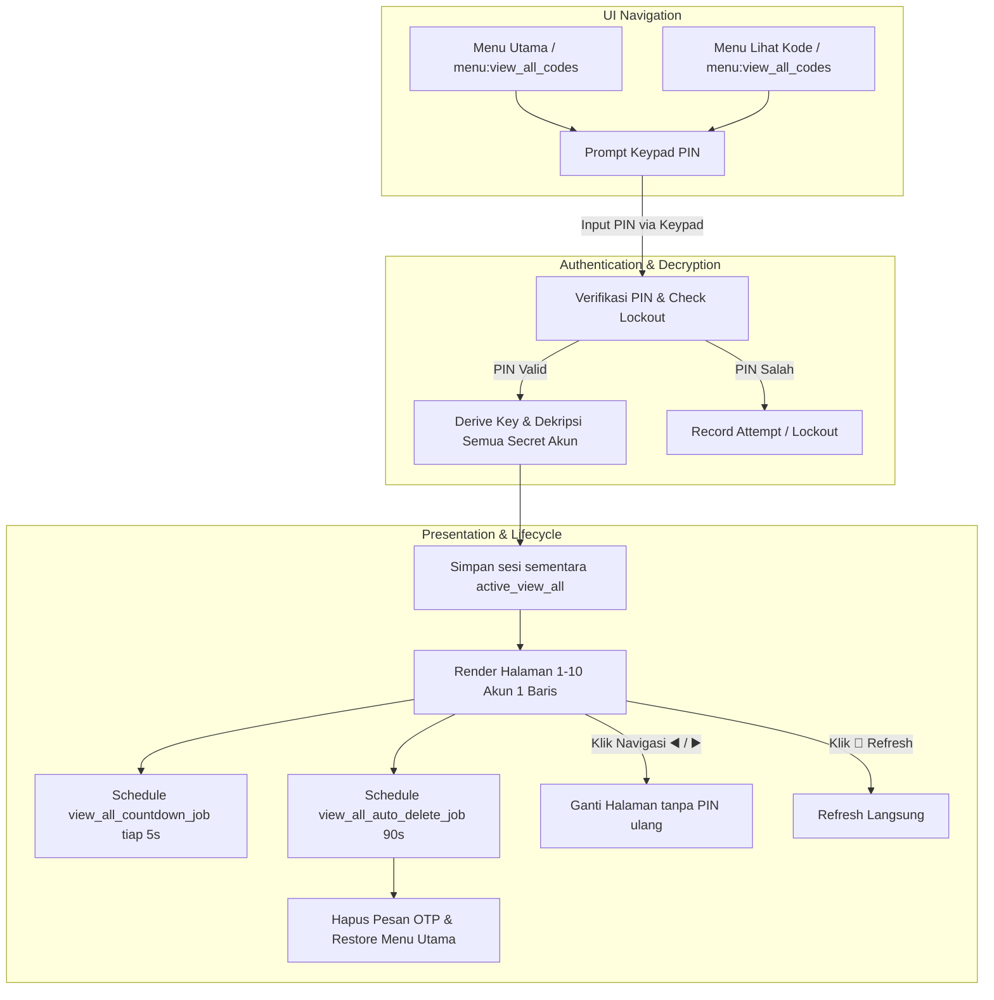

# View All OTP Codes Implementation Plan

> **For agentic workers:** REQUIRED SUB-SKILL: Use superpowers:subagent-driven-development to implement this plan task-by-task. Steps use checkbox (`- [ ]`) syntax for tracking.

**Goal:** Menambahkan fitur "Lihat Semua Kode OTP" dengan otentikasi PIN tunggal, format 1 akun per baris (maksimal 10 akun per halaman), navigasi halaman jika akun > 10, auto-refresh tiap 5 detik, dan auto-delete dalam 90 detik dengan auto-restore menu utama.

**Architecture:** Memisahkan logika fitur ke dalam modul mandiri `handlers/view_all_codes.py` untuk isolasi tanggung jawab (Separation of Concerns). Modul ini mengelola validasi PIN, dekripsi batch semua secret akun dalam memori, rendering pesan berpaginasi, auto-refresh countdown job, dan auto-delete lifecycle. Integrasi titik akses dilakukan melalui `handlers/menu.py`, `handlers/view_code.py`, dan router callback di `bot.py`.

**Architecture Diagram:**



**Tech Stack:** Python 3.11+, python-telegram-bot v20+, SQLAlchemy 2.0 (Async), PyOTP, Cryptography (AES-256-GCM), Argon2id, Pytest.

## Global Constraints
- Kode OTP diformat dalam tag `<code>...</code>` tanpa spasi agar mendukung *tap-to-copy*.
- Maksimal 10 akun per halaman. Jika > 10 akun, sertakan tombol pagination `[◀️ Sebelumnya] [ 1 / N ] [Selanjutnya ▶️]`.
- 1 akun 1 baris: `{no}. {emoji} <b>{label}</b>: <code>{otp}</code> ({status})`.
- Sesi didekripsi ke RAM hanya selama `AUTO_DELETE_SECONDS` (default: 90 detik) dan tidak disimpan ke disk.
- Semua string user (label, issuer) harus di-escape dengan `html.escape` untuk mencegah HTML parsing error Telegram.
- Error Telegram API benign (`Message is not modified`, `Query is too old`, `Message to edit not found`) harus di-guard dengan try/except.
- Pengguna yang terkunci lockout harus diblokir dengan pesan sisa waktu tunggu.

---

### Task 1: Module `handlers/view_all_codes.py` Core Logic & Formatting

**Files:**
- Create: `handlers/view_all_codes.py`
- Test: `tests/test_view_all_codes.py`

**Interfaces:**
- Produces:
  - `render_view_all_page(accounts: list, page: int, total_pages: int, auto_del_secs: int) -> tuple[str, InlineKeyboardMarkup]`
  - `cancel_view_all_jobs(context, chat_id: int, message_id: int) -> None`
  - `handle_view_all_codes_start(update: Update, context: ContextTypes.DEFAULT_TYPE) -> None`
  - `handle_view_all_pin_keypad(update: Update, context: ContextTypes.DEFAULT_TYPE) -> None`
  - `handle_view_all_page(update: Update, context: ContextTypes.DEFAULT_TYPE, page: int) -> None`
  - `handle_view_all_refresh(update: Update, context: ContextTypes.DEFAULT_TYPE) -> None`
  - `view_all_countdown_job(context: ContextTypes.DEFAULT_TYPE) -> None`
  - `view_all_auto_delete_job(context: ContextTypes.DEFAULT_TYPE) -> None`

- [ ] **Step 1: Write the failing tests for view all codes rendering and start prompt**

Create `tests/test_view_all_codes.py`:
```python
import html
import pytest
from unittest.mock import AsyncMock, MagicMock
from telegram.constants import ParseMode
from db.models import Account, User
from handlers.view_all_codes import (
    render_view_all_page,
    handle_view_all_codes_start,
)

def test_render_view_all_page_single_page():
    accounts = [
        {
            "id": 1,
            "label": "GitHub: alice",
            "issuer": "GitHub",
            "type": "totp",
            "digits": 6,
            "period": 30,
            "secret": "JBSWY3DPEHPK3PXP",
            "emoji": "🐙",
            "hotp_counter": 0,
        },
        {
            "id": 2,
            "label": "Google Work",
            "issuer": "Google",
            "type": "totp",
            "digits": 6,
            "period": 30,
            "secret": "JBSWY3DPEHPK3PXP",
            "emoji": "🌐",
            "hotp_counter": 0,
        }
    ]
    text, markup = render_view_all_page(accounts, page=1, total_pages=1, auto_del_secs=90)
    assert "Semua Kode OTP (Halaman 1/1)" in text
    assert "1. 🐙 <b>GitHub: alice</b>: <code>" in text
    assert "2. 🌐 <b>Google Work</b>: <code>" in text
    assert "Tap kode di atas untuk menyalin ke clipboard." in text
    # No pagination row because total_pages == 1
    buttons = markup.inline_keyboard
    assert len(buttons) == 1
    assert buttons[0][0].text == "🔄 Refresh Semua"
    assert buttons[0][1].text == "🔙 Menu Utama"


def test_render_view_all_page_multi_page_pagination_buttons():
    accounts = [
        {
            "id": i,
            "label": f"Account {i}",
            "issuer": "Test",
            "type": "totp",
            "digits": 6,
            "period": 30,
            "secret": "JBSWY3DPEHPK3PXP",
            "emoji": "🔐",
            "hotp_counter": 0,
        } for i in range(1, 11)
    ]
    text, markup = render_view_all_page(accounts, page=1, total_pages=3, auto_del_secs=90)
    assert "Semua Kode OTP (Halaman 1/3)" in text
    buttons = markup.inline_keyboard
    assert len(buttons) == 2
    # Row 1 is pagination
    assert buttons[0][0].callback_data == "view_all:page:1"
    assert buttons[0][1].text == "1 / 3"
    assert buttons[0][2].callback_data == "view_all:page:2"
    # Row 2 is actions
    assert buttons[1][0].text == "🔄 Refresh Semua"
    assert buttons[1][1].text == "🔙 Menu Utama"
```

- [ ] **Step 2: Run test to verify it fails**

Run: `pytest tests/test_view_all_codes.py -v`
Expected: FAIL (ModuleNotFoundError: No module named 'handlers.view_all_codes')

- [ ] **Step 3: Implement `handlers/view_all_codes.py`**

Create `handlers/view_all_codes.py`:
Implement:
1. `render_view_all_page(accounts_slice, page, total_pages, auto_del_secs)`:
   - Formats up to 10 accounts with 1 account per line.
   - Generates OTP codes (`generate_totp_code` / `generate_hotp_code`) and remaining interval.
   - Monospace `<code>...</code>` tag for easy tap-to-copy.
   - Generates `InlineKeyboardMarkup` with pagination buttons if `total_pages > 1`, and `[🔄 Refresh Semua] [🔙 Menu Utama]`.
2. `cancel_view_all_jobs(context, chat_id, message_id)`:
   - Cancels `view_all_cd_{chat_id}_{message_id}` and `view_all_del_{chat_id}_{message_id}`.
3. `handle_view_all_codes_start(update, context)`:
   - Checks lockout via `check_lockout`.
   - Checks if user has accounts in DB. If none, informs user.
   - Prepares `context.user_data["view_all_pin"] = ""` buffer.
   - Displays keypad with `build_keypad_keyboard("view_all_pin", show_cancel=True)`.
4. `handle_view_all_pin_keypad(update, context)`:
   - Processes keypad input.
   - On cancel: clears buffer, calls `show_main_menu`.
   - On complete: checks lockout, verifies PIN with `verify_pin`.
   - If incorrect: records failed attempt, displays remaining attempts/lockout.
   - If correct: derives AES key with `derive_encryption_key`, decrypts all accounts for user.
   - Stores session in `context.user_data["active_view_all"]`.
   - Schedules `view_all_countdown_job` (every 5 seconds) and `view_all_auto_delete_job` (at `auto_del_secs`).
   - Renders page 1 and edits message.
5. `handle_view_all_page(update, context, page)`:
   - Validates `active_view_all` session.
   - Updates `active_view_all["page"] = page`.
   - Renders accounts for page `(page-1)*10 : page*10`.
   - Edits message cleanly with try/except ("Message is not modified").
6. `handle_view_all_refresh(update, context)`:
   - Validates `active_view_all` session.
   - Re-renders current page with fresh OTPs and remaining seconds.
   - Answers query with `🔄 Semua kode OTP diperbarui!`.
7. `view_all_countdown_job(context)`:
   - Checks if `time.time() >= expires_at`. If so, schedules removal.
   - Re-renders active page with fresh OTPs.
   - Edits message via `context.bot.edit_message_text`.
8. `view_all_auto_delete_job(context)`:
   - Deletes message `context.bot.delete_message(chat_id=..., message_id=...)`.
   - Clears `context.user_data["active_view_all"]`.
   - Restores main menu using `context.bot.send_message`.

- [ ] **Step 4: Run tests to verify rendering and keypad logic passes**

Run: `pytest tests/test_view_all_codes.py -v`
Expected: PASS

- [ ] **Step 5: Commit module and unit tests**

```bash
git add handlers/view_all_codes.py tests/test_view_all_codes.py
git commit -m "feat(otp): implement view all OTP codes module and layout renderer"
```

---

### Task 2: Integration with Menu, Keypad Buffers, and View Code Menu

**Files:**
- Modify: `handlers/menu.py`
- Modify: `handlers/view_code.py`
- Test: `tests/test_menu_handlers.py`
- Test: `tests/test_view_code.py`

**Interfaces:**
- `handlers/menu.py`:
  - `get_main_menu_keyboard()`: Add `👁️ Semua Kode` button.
  - `clear_user_workflow_state()`: Add `"active_view_all"` to `keys_to_clear` and `"view_all_pin"` to `keypad_prefixes`.
  - `show_main_menu()`: Cancel view all countdown and auto-delete jobs if `active_view_all` exists.
- `handlers/view_code.py`:
  - `handle_view_code_menu()`: Add `👁️ Lihat Semua Kode Sekaligus` button in `buttons` list.

- [ ] **Step 1: Write test for main menu keyboard and clear state**

In `tests/test_menu_handlers.py`:
```python
def test_main_menu_keyboard_has_view_all_button():
    from handlers.menu import get_main_menu_keyboard
    kb = get_main_menu_keyboard()
    flattened = [btn.callback_data for row in kb.inline_keyboard for btn in row]
    assert "menu:view_all_codes" in flattened

def test_clear_user_workflow_state_clears_view_all():
    from handlers.menu import clear_user_workflow_state
    user_data = {
        "active_view_all": {"page": 1},
        "view_all_pin": "123",
    }
    clear_user_workflow_state(user_data)
    assert "active_view_all" not in user_data
    assert "view_all_pin" not in user_data
```

- [ ] **Step 2: Run test to verify it fails**

Run: `pytest tests/test_menu_handlers.py::test_main_menu_keyboard_has_view_all_button -v`
Expected: FAIL

- [ ] **Step 3: Modify `handlers/menu.py` and `handlers/view_code.py`**

In `handlers/menu.py`:
Update `get_main_menu_keyboard()`:
```python
def get_main_menu_keyboard() -> InlineKeyboardMarkup:
    keyboard = [
        [
            InlineKeyboardButton("➕ Tambah Akun", callback_data="menu:add_account"),
            InlineKeyboardButton("🔑 Lihat Kode", callback_data="menu:view_code"),
            InlineKeyboardButton("👁️ Semua Kode", callback_data="menu:view_all_codes"),
        ],
        [
            InlineKeyboardButton("🔍 Cari Akun", callback_data="menu:search_account"),
            InlineKeyboardButton("⭐ Favorit", callback_data="menu:favorite_accounts"),
        ],
        [
            InlineKeyboardButton("✏️ Kelola Akun", callback_data="menu:manage_account"),
            InlineKeyboardButton("⚙️ Pengaturan", callback_data="menu:settings"),
        ],
    ]
    return InlineKeyboardMarkup(keyboard)
```
Add `"active_view_all"` to `keys_to_clear` and `"view_all_pin"` to `keypad_prefixes`.
In `show_main_menu()`:
```python
    active_view_all = context.user_data.get("active_view_all")
    if active_view_all and isinstance(active_view_all, dict) and update.effective_chat:
        mid = active_view_all.get("message_id")
        if mid:
            from handlers.view_all_codes import cancel_view_all_jobs
            cancel_view_all_jobs(context, update.effective_chat.id, mid)
```

In `handlers/view_code.py`:
In `handle_view_code_menu()`:
If `accounts` exists and not `favorites_only`:
Add button `[InlineKeyboardButton("👁️ Lihat Semua Kode Sekaligus", callback_data="menu:view_all_codes")]` before the account list buttons.

- [ ] **Step 4: Run tests to verify they pass**

Run: `pytest tests/test_menu_handlers.py tests/test_view_code.py -v`
Expected: PASS

- [ ] **Step 5: Commit changes**

```bash
git add handlers/menu.py handlers/view_code.py tests/test_menu_handlers.py
git commit -m "feat(menu): integrate view all codes buttons in main menu and view code menu"
```

---

### Task 3: Router Callback Registration in `bot.py`

**Files:**
- Modify: `bot.py`
- Test: `tests/test_view_all_codes.py`

**Interfaces:**
- Consumes:
  - `handle_view_all_codes_start`
  - `handle_view_all_pin_keypad`
  - `handle_view_all_page`
  - `handle_view_all_refresh`
- Produces:
  - Routes `menu:view_all_codes`, `view_all_pin:*`, `view_all:page:*`, and `view_all:refresh` in `callback_router`.

- [ ] **Step 1: Write integration tests for bot router dispatching to view all handlers**

In `tests/test_view_all_codes.py`:
Add test `test_callback_router_routes_view_all_actions`:
```python
@pytest.mark.asyncio
async def test_callback_router_routes_view_all(mocker):
    from bot import callback_router

    mock_start = mocker.patch("bot.handle_view_all_codes_start", new_callable=AsyncMock)
    mock_keypad = mocker.patch("bot.handle_view_all_pin_keypad", new_callable=AsyncMock)
    mock_page = mocker.patch("bot.handle_view_all_page", new_callable=AsyncMock)
    mock_refresh = mocker.patch("bot.handle_view_all_refresh", new_callable=AsyncMock)

    update = MagicMock()
    context = MagicMock()

    # Route start
    update.callback_query.data = "menu:view_all_codes"
    await callback_router(update, context)
    mock_start.assert_awaited_once_with(update, context)

    # Route keypad
    update.callback_query.data = "view_all_pin:key:1"
    await callback_router(update, context)
    mock_keypad.assert_awaited_once_with(update, context)

    # Route page
    update.callback_query.data = "view_all:page:2"
    await callback_router(update, context)
    mock_page.assert_awaited_once_with(update, context, 2)

    # Route refresh
    update.callback_query.data = "view_all:refresh"
    await callback_router(update, context)
    mock_refresh.assert_awaited_once_with(update, context)
```

- [ ] **Step 2: Run test to verify it fails**

Run: `pytest tests/test_view_all_codes.py::test_callback_router_routes_view_all -v`
Expected: FAIL (ImportError / AttributeError in bot router)

- [ ] **Step 3: Update `bot.py` with imports and router conditions**

In `bot.py`:
Import `handle_view_all_codes_start`, `handle_view_all_pin_keypad`, `handle_view_all_page`, `handle_view_all_refresh` from `handlers.view_all_codes`.
In `callback_router`:
```python
    elif data == "menu:view_all_codes":
        await handle_view_all_codes_start(update, context)
    elif data.startswith("view_all_pin:"):
        await handle_view_all_pin_keypad(update, context)
    elif data.startswith("view_all:page:"):
        page = int(data.split(":")[2])
        await handle_view_all_page(update, context, page)
    elif data == "view_all:refresh":
        await handle_view_all_refresh(update, context)
```

- [ ] **Step 4: Run test to verify router passes**

Run: `pytest tests/test_view_all_codes.py::test_callback_router_routes_view_all -v`
Expected: PASS

- [ ] **Step 5: Commit router updates**

```bash
git add bot.py tests/test_view_all_codes.py
git commit -m "feat(bot): register view all OTP codes callback routes"
```

---

### Task 4: Comprehensive End-to-End Tests for View All OTP Flow

**Files:**
- Modify: `tests/test_view_all_codes.py`

**Interfaces:**
- Tests all edge cases:
  1. `test_view_all_no_accounts_displays_empty_notice`
  2. `test_view_all_locked_user_blocked`
  3. `test_view_all_correct_pin_displays_10_accounts_per_line`
  4. `test_view_all_pagination_switch_page_without_pin`
  5. `test_view_all_refresh_updates_session_and_message`
  6. `test_view_all_auto_delete_job_restores_main_menu`
  7. `test_view_all_countdown_job_regenerates_dynamic_otp`

- [ ] **Step 1: Write comprehensive async test suite in `tests/test_view_all_codes.py`**

Implement tests using `session_factory` and seeded multi-account data (15 accounts to test pagination, HOTP & TOTP types, 6 & 8 digits, lockout attempts).

- [ ] **Step 2: Run all tests in test_view_all_codes.py**

Run: `pytest tests/test_view_all_codes.py -v`
Expected: PASS (all tests pass)

- [ ] **Step 3: Run the entire repository test suite**

Run: `pytest -v`
Expected: PASS (100% pass across all test files)

- [ ] **Step 4: Update README.md with the new feature and test count**

Update `README.md` test badge, feature list, and test count summary.

- [ ] **Step 5: Commit test suite and README**

```bash
git add tests/test_view_all_codes.py README.md
git commit -m "test(otp): add comprehensive test suite for view all OTP codes feature and update docs"
```
