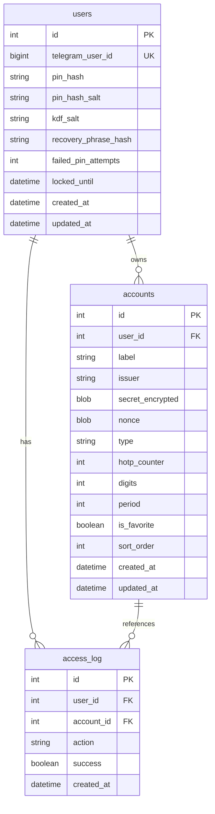
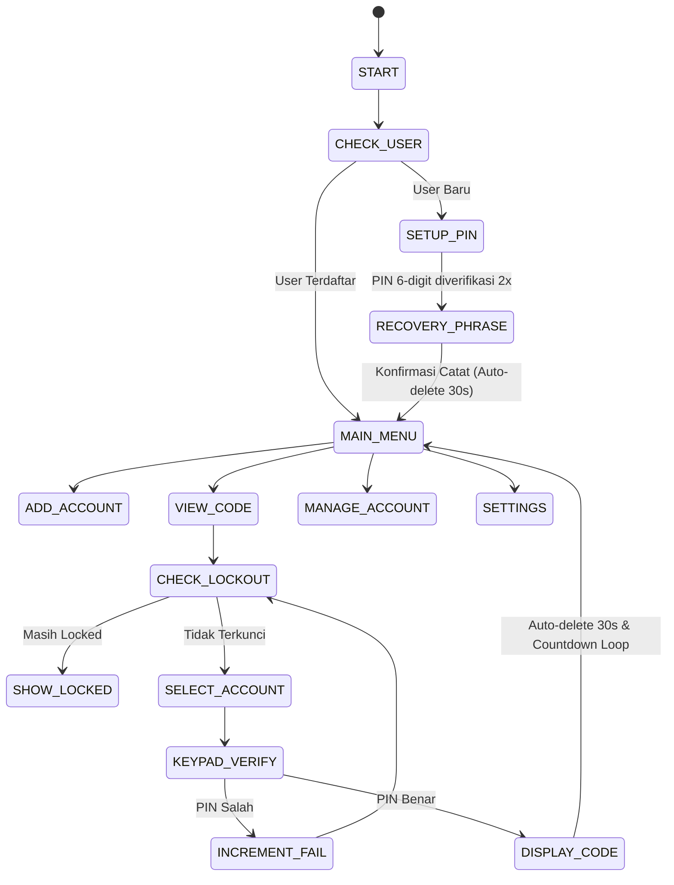

# Desain Sistem: Bot Telegram Authenticator (TOTP/HOTP MFA)

## 1. Ringkasan Eksekutif
Sistem ini merupakan Bot Telegram yang berfungsi sebagai aplikasi *two-factor authenticator* mandiri (setara Google Authenticator / Authy), dihosting di VPS menggunakan Python. Bot mendukung multi-tenant dengan data antar-pengguna terisolasi penuh dan dienkripsi kuat menggunakan PIN pribadi user.

Navigasi sepenuhnya memanfaatkan inline button dan inline numeric keypad sehingga pengguna tidak perlu mengetikkan PIN secara terbuka pada chat Telegram.

---

## 2. Arsitektur & Struktur Direktori

Seluruh komponen ditempatkan langsung di root repositori:

```text
MFA/
├── bot.py                     # Entry point & inisialisasi ApplicationBuilder
├── config.py                  # Pydantic / dotenv configuration loader
├── .env.example               # Template environment variables
├── requirements.txt           # Python dependencies
├── db/
│   ├── __init__.py
│   ├── models.py              # User, Account, AccessLog (SQLAlchemy async)
│   └── session.py             # Engine & async_sessionmaker (aiosqlite)
├── crypto/
│   ├── __init__.py
│   ├── kdf.py                 # Argon2id: verifikasi PIN & derive key enkripsi
│   ├── cipher.py              # AES-256-GCM (encrypt, decrypt dengan nonce acak 12-byte)
│   └── recovery.py            # 12 kata acak (BIP-39 English & Indonesian wordlist)
├── services/
│   ├── __init__.py
│   ├── otp_service.py         # Wrapper TOTP / HOTP (pyotp) & URI parser
│   ├── qr_service.py          # Decode QR (pyzbar + penanganan DLL Windows) & Encode (qrcode)
│   ├── icon_service.py        # Pemetaan issuer -> emoji
│   ├── lockout_service.py     # Exponential backoff (5m -> 15m -> 1h) & verifikasi status lock
│   ├── log_service.py         # Perekaman audit log tanpa data sensitif
│   └── backup_service.py      # Ekspor/Impor JSON terenkripsi passphrase mandiri
├── handlers/
│   ├── __init__.py
│   ├── keypad.py              # Reusable inline numeric keypad (0-9, ⌫, ✅, ❌)
│   ├── start.py               # /start & alur registrasi PIN awal + recovery phrase
│   ├── menu.py                # Main menu dashboard & navigasi
│   ├── add_account.py         # Alur scan QR & input manual secret
│   ├── view_code.py           # Pemilihan akun, input PIN, auto-refresh countdown, auto-delete 30s
│   ├── manage_account.py      # Ubah label, favorit, urutkan, hapus akun
│   └── settings.py            # Ganti PIN, ekspor backup, impor backup, audit log pagination
├── deploy/
│   ├── telegram-mfa-bot.service
│   └── README-deploy.md
└── tests/
    ├── __init__.py
    ├── conftest.py
    ├── test_crypto.py
    ├── test_otp.py
    ├── test_lockout.py
    ├── test_backup.py
    └── test_db.py
```

---

## 3. Model Kriptografi & Keamanan

### 3.1 Manajemen Kunci & Salt
- **Tanpa Master Key**: Server tidak memiliki master key untuk membuka data akun user.
- **Dua Salt Terpisah per User (16-byte random hex)**:
  1. `pin_hash_salt`: Digunakan untuk menghasilkan `pin_hash` via Argon2id. Digunakan khusus memverifikasi kebenaran PIN tanpa membuka data rahasia.
  2. `kdf_salt`: Digunakan terpisah dengan Argon2id untuk menurunkan 32-byte (256-bit) `encryption_key` dari PIN user.
- **Argon2id Parameters**:
  - `time_cost = 2`
  - `memory_cost = 65536` (64 MB)
  - `parallelism = 1`
  - `hash_len = 32`

### 3.2 Enkripsi Data Akun (AES-256-GCM)
- Secret TOTP/HOTP dienkripsi dengan AES-256-GCM.
- Nonce 12-byte acak dibuat unik untuk setiap operasi enkripsi.
- Kolom database menyimpan: `secret_encrypted` (ciphertext + 16-byte authentication tag) dan `nonce`.
- Dekripsi dilakukan murni secara *in-memory* sesaat sebelum generate kode OTP, kemudian variabel memory langsung di-clear.

### 3.3 Recovery Phrase (Dwi-Bahasa)
- Menghasilkan 12 kata unik:
  - Default: BIP-39 English wordlist (2048 kata standar).
  - Opsi: Indonesian wordlist (kata-kata bahasa Indonesia yang jelas dan mudah dihafal).
- Hash recovery phrase (`recovery_phrase_hash`) disimpan di tabel `users` untuk verifikasi saat pengguna lupa PIN dan ingin melakukan reset.

---

## 4. Skema Database (SQLAlchemy Async)



---

## 5. Alur & State Machine



### 5.1 Format Monospace Kode OTP
Sesuai arahan spesifik, kode OTP ditampilkan dalam tag kode tanpa spasi:
`<code>123456</code>`
Sehingga saat disentuh/di-tap di aplikasi Telegram, seluruh 6 digit langsung tersalin ke clipboard tanpa karakter tambahan.

Visual countdown untuk TOTP:
`⏳ [■■■■■■□□□□] 18 detik lagi`
Pesan di-update tiap 5 detik dan dihapus otomatis setelah 30 detik.

---

## 6. Penanganan Lockout & Keamanan Lanjutan
- Kegagalan 1..4: Menampilkan pesan peringatan sisa percobaan.
- Kegagalan ke-5: Terkunci 5 menit (`locked_until = now + 5 min`).
- Kegagalan berikutnya setelah masa buka berakhir: 15 menit, lalu maksimum 60 menit (exponential backoff).
- Percobaan sukses: `failed_pin_attempts` direset menjadi 0 dan `locked_until` di-set NULL.

---

## 7. Strategi Pengujian (TDD & Automated Tests)
Pengujian mencakup:
1. `tests/test_crypto.py`:
   - Argon2id salt generation & verification
   - KDF key derivation determinism
   - AES-256-GCM encryption & decryption
   - Tamper-proofing (tag error on modified ciphertext or wrong key)
   - Dual-language recovery phrase generation & hash verification
2. `tests/test_otp.py`:
   - RFC 6238 TOTP vector testing
   - RFC 4226 HOTP vector testing & counter increment
   - Otpauth URI parsing (`otpauth://totp/...`, `otpauth://hotp/...`)
3. `tests/test_lockout.py`:
   - 5-failure threshold triggers 5-minute lockout
   - Multi-stage lockout escalation (5m -> 15m -> 60m)
   - Reset counter upon correct entry
4. `tests/test_backup.py`:
   - Export serialization & encryption with standalone passphrase
   - Import decryption and re-encryption with user active key
5. `tests/test_db.py`:
   - Multi-tenant isolation: User A cannot query or decrypt User B accounts
   - Cascade deletions and access log persistence
